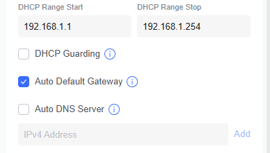
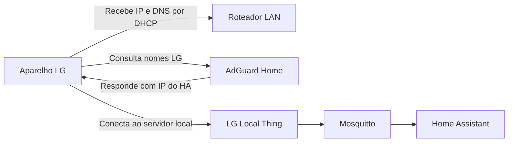

# LG_Local-Thing

Home Assistant Add-on Repository mantido por **Smart House**, derivado do
[ReThink](https://github.com/anszom/rethink).

## 📘 Manual de implantação

Para instalar o projeto em um novo cliente, use o manual completo:

**[Baixar / abrir o Manual de Implantação LG_Local-Thing 1.0.0 (PDF)](docs/Manual_Implantacao_LG_Local-Thing_1.0.0_COMPLETO.pdf)**

## Implantação passo a passo

Siga a ordem abaixo. O provisionamento dos aparelhos acontece somente depois
de MQTT e DNS estarem funcionando.

1. Instalar o LG Local Thing.
2. Instalar o Mosquitto e criar o usuário MQTT.
3. Conectar o Home Assistant e o LG Local Thing ao MQTT.
4. Instalar o AdGuard Home e criar as reescritas DNS.
5. Configurar o DNS da LAN no roteador e testar.
6. Preparar a ferramenta de provisionamento no Windows.
7. Provisionar e conferir um aparelho por vez.

Os nomes dos menus podem aparecer como **Aplicativos**, **Apps** ou
**Complementos**, conforme a versão do Home Assistant.

### 1. Instalar o LG Local Thing

No Home Assistant, abra **Configurações → Aplicativos/Complementos → Loja**.
No menu de repositórios, adicione:

```text
https://github.com/aoliveira07/LG_Local-Thing
```

Instale **LG Local Thing**. Antes de iniciar o serviço, conclua as etapas
de MQTT abaixo.

### 2. Preparar o servidor MQTT e as credenciais

MQTT é o canal de comunicação entre o LG Local Thing e o Home Assistant.
O **Mosquitto broker** é o servidor que recebe e encaminha as mensagens.

1. Na loja do Home Assistant, instale **Mosquitto broker**.
2. Ative **Iniciar na inicialização**, inicie o Mosquitto e confira seus logs.
3. Abra **Configurações → Pessoas → Usuários**. Se a aba não aparecer,
   habilite o **Modo avançado** no seu perfil.
4. Crie um usuário dedicado, por exemplo `lg_mqtt`, com uma senha própria.
   Ele não precisa ser administrador. Guarde o nome de usuário e a senha:
   eles serão usados na próxima etapa.
5. Não use `homeassistant` nem `addons` como nome: são reservados.

Para esse método, o usuário é criado no **Home Assistant**, não na lista
`logins` do Mosquitto. O broker não aceita autenticação anônima.

Referência: [documentação do Mosquitto para Home Assistant](https://github.com/home-assistant/addons/blob/master/mosquitto/DOCS.md).

### 3. Configurar MQTT no Home Assistant e no LG Local Thing

#### 3.1. Integração MQTT do Home Assistant

Abra **Configurações → Dispositivos e serviços** e configure a integração
**MQTT** descoberta. Se ela não aparecer, use **Adicionar integração → MQTT**.

Na configuração manual com o Mosquitto instalado no mesmo Home Assistant,
use o broker `core-mosquitto`, porta `1883` e o usuário e a senha criados
acima. Se a integração descoberta já preencher os dados internos, mantenha-os.
Conclua a configuração com a descoberta MQTT habilitada.

#### 3.2. Opções do LG Local Thing

Abra **LG Local Thing → Configuração** e preencha estes campos na interface:

| Campo | Valor / orientação |
|---|---|
| `hostname` | Manter `rethink.lgthinq.com` |
| `mqtt_url` | `mqtt://localhost:1883`, quando o Mosquitto estiver no mesmo HA e sua porta 1883 estiver publicada |
| `mqtt_user` | O nome do usuário criado, por exemplo `lg_mqtt` |
| `mqtt_pass` | A senha desse usuário |
| `discovery_prefix` | Manter `homeassistant` |
| `rethink_prefix` | Manter `rethink` |

O LG Local Thing usa rede do host nesta distribuição. Se o broker estiver em
outra máquina, use `mqtt://IP_DO_BROKER:1883`, substituindo
`IP_DO_BROKER` pelo endereço real. Não copie esse marcador literalmente.

Salve, inicie o LG Local Thing e habilite a inicialização automática.
Se já estava iniciado, reinicie-o depois de salvar.

**Antes de avançar:** procure `HA mqtt connection established` nos logs
do LG Local Thing. Se houver falha de autenticação, confira usuário e senha.
Se houver recusa de conexão, confira se o Mosquitto está iniciado, seu endereço
e a porta publicada.

Não use as portas `1885` ou `8885` como porta do Mosquitto:
elas pertencem à comunicação dos aparelhos com o LG Local Thing.

### 4. Instalar e configurar o AdGuard Home

O AdGuard Home fornecerá o DNS local: ao consultar os nomes da LG, os
aparelhos serão direcionados para o servidor desta instalação.

1. Antes de instalar, configure IP estático e DNS externo no próprio
   Home Assistant, em **Configurações → Sistema → Rede**. Anote o IP do HA,
   a máscara e o gateway corretos da rede.
2. Instale **AdGuard Home** pela loja, ative a inicialização automática,
   inicie e confira os logs. Abra **Interface Web**.
3. Em **Filtros → Reescritas DNS** (*DNS rewrites*), adicione:

| Domínio | Endereço de resposta |
|---|---|
| `common.lgthinq.com` | IP do Home Assistant que executa o LG Local Thing |
| `rethink.lgthinq.com` | O mesmo IP |

Use o IP real da instalação. Não use o endereço temporário do aparelho.
Mantenha TTL não zero. Confirme que o serviço DNS atende na porta 53.

O add-on AdGuard recomenda IP estático configurado no HA; somente uma
reserva DHCP no roteador não substitui essa configuração.

Referências: [AdGuard Home no HA](https://github.com/hassio-addons/addon-adguard-home/blob/main/adguard/DOCS.md)
e [redirecionamento no ReThink](https://github.com/anszom/rethink/wiki/Installing-rethink%E2%80%90cloud).

### 5. Configurar LAN / DHCP / DNS no roteador

**Criar as reescritas no AdGuard não basta.** Os aparelhos precisam consultar
esse servidor DNS. O roteador normalmente informa qual DNS usar quando
entrega um endereço IP por DHCP.

Abra a administração do roteador e procure **LAN → DHCP Server → DNS**,
ou o menu equivalente do fabricante. O campo relevante é o DNS entregue
aos clientes da LAN. Alterar somente o DNS da conexão WAN pode não produzir
esse resultado.

#### UniFi Controller / UniFi Network

No UniFi Network, abra **Settings → Networks → selecione a rede dos
aparelhos LG → DHCP Service Management → DNS Server**. Os nomes e a
posição dos campos variam conforme a versão.



A captura acima mostra a seção usada nesta implantação. **Auto DNS Server**
já está desmarcado, mas ainda falta preencher o endereço do DNS.

1. Mantenha **Auto Default Gateway** na configuração atual. Esse campo
   não é o DNS.
2. Desmarque **Auto DNS Server**.
3. Em **IPv4 Address**, digite o IP fixo do Home Assistant onde o
   AdGuard Home está atendendo.
4. Clique em **Add** e confirme que o endereço entrou na lista.
5. Salve/aplique as alterações da rede.
6. Reconecte o notebook e renove a conexão dos aparelhos para receberem
   a configuração DHCP atualizada. Execute os testes abaixo.

**Não copie o DHCP Range Start/Stop da captura.** Preserve a faixa de
endereços planejada para a instalação; o IP estático do HA deve estar
protegido contra atribuição a outro cliente.

Não adicione DNS público à lista: os clientes podem usá-lo e ignorar as
reescritas do AdGuard. Para redundância, outro servidor DNS local precisa
ter as mesmas reescritas.

Se os aparelhos usam uma VLAN/SSID IoT, configure a rede correspondente
e permita o acesso dela ao AdGuard na porta 53 (UDP/TCP), além das portas
do LG Local Thing. Se o UniFi gerencia somente os access points e o DHCP
é fornecido por outro roteador, ajuste o DNS nesse roteador.

Referência: [Ubiquiti — DNS da rede via DHCP](https://help.ui.com/hc/en-us/articles/15179064940439-UniFi-DNS-Records-and-Local-Hostnames).



Depois de salvar, reconecte o notebook ao Wi-Fi da instalação. Se a rede
também anunciar DNS por IPv6, confira se ele não contorna o AdGuard.

#### Testar antes de provisionar

No PowerShell, ainda conectado à rede normal da instalação:

```powershell
$HA_IP = Read-Host "Digite o IP do Home Assistant / AdGuard"

# Testa diretamente as reescritas do AdGuard
nslookup common.lgthinq.com $HA_IP
nslookup rethink.lgthinq.com $HA_IP

# Testa o DNS que o notebook recebeu da rede
ipconfig /all
nslookup common.lgthinq.com
nslookup rethink.lgthinq.com
```

**Resultado esperado:** as duas consultas retornam o IP do HA.
Se a consulta direta funcionar e a consulta normal falhar, revise o DNS
distribuído pelo DHCP. Confira também o **Registro de consultas** do AdGuard.

Se o roteador não permitir configurar DNS da LAN, identifique seu modelo
antes de prosseguir; a alternativa depende da rede.

### 6. Preparar a ferramenta no notebook Windows

Faça esta etapa conectado à internet, **antes** de entrar no Wi-Fi temporário
do aparelho.

Instale [Git para Windows](https://git-scm.com/download/win) e
[Node.js](https://nodejs.org/en/download), incluindo npm. Feche e abra o
PowerShell após a instalação.

Verifique:

```powershell
git --version
node --version
npm.cmd --version
```

Prepare uma cópia exclusiva do upstream no commit congelado:

```powershell
$ProvisionRoot = Join-Path $env:USERPROFILE "SmartHouse"
New-Item -ItemType Directory -Force -Path $ProvisionRoot | Out-Null
Set-Location $ProvisionRoot

# Execute o clone somente se esta pasta ainda nao existir.
git clone https://github.com/anszom/rethink.git rethink
Set-Location .\rethink

git checkout --detach 8f6d19ec9939f5f785bb1def3810540730e31bce
git rev-parse HEAD

npm.cmd ci
npx.cmd --no-install tsx --version
```

O hash exibido deve ser `8f6d19ec9939f5f785bb1def3810540730e31bce`.
Se um comando falhar, resolva antes de avançar. Se a pasta já existir,
confira seu conteúdo e entre nela; não a apague nem descarte alterações.

A ferramenta usada é o `rethink-setup.ts` original. Não é necessário iniciar
outro servidor ReThink no notebook: o servidor já está no HA.
O teste do `tsx` confirma que o executável está instalado antes de perder
o acesso à internet ao conectar ao aparelho.

### 7. Provisionar cada aparelho, um por vez

Para cada aparelho:

1. Ative o modo de configuração Wi-Fi seguindo o manual do modelo.
   A combinação de botões e a senha do ponto de acesso variam por modelo.
2. Conecte o notebook ao Wi-Fi temporário desse aparelho. É normal essa
   rede não ter internet.
3. Execute o bloco abaixo no PowerShell. Informe o SSID e a senha da
   **rede de destino da instalação**, não os dados do Wi-Fi temporário.
   Use a faixa e o tipo de segurança suportados pelo modelo.
4. Aguarde o término. Reconecte o notebook à rede da instalação e confira
   o aparelho no painel do LG Local Thing e na integração MQTT do HA.
5. Somente então passe ao próximo aparelho.

#### Comando a executar novamente para cada equipamento

```powershell
Set-Location "$env:USERPROFILE\SmartHouse\rethink"

$WIFI_SSID = Read-Host "SSID da rede da instalacao"
$WifiSecret = Read-Host "Senha dessa rede Wi-Fi" -AsSecureString
$WifiPointer = [Runtime.InteropServices.Marshal]::SecureStringToBSTR($WifiSecret)

try {
    $WIFI_PASS = [Runtime.InteropServices.Marshal]::PtrToStringBSTR($WifiPointer)
    npx.cmd --no-install tsx .\rethink-setup.ts 192.168.120.254 "$WIFI_SSID" "$WIFI_PASS"
}
finally {
    [Runtime.InteropServices.Marshal]::ZeroFreeBSTR($WifiPointer)
    Remove-Variable WIFI_PASS, WifiSecret, WifiPointer -ErrorAction SilentlyContinue
}
```

O endereço `192.168.120.254` é o endereço usual do **aparelho no modo
de provisionamento**, não o IP do HA. Se não houver conexão, confira se
o notebook está no Wi-Fi do aparelho e se o modelo usa esse endereço.

| Ciclo | Procedimento |
|---|---|
| Primeiro aparelho | Conectar ao Wi-Fi dele, executar o bloco, validar |
| Segundo aparelho | Ativar o modo Wi-Fi dele, trocar a rede do notebook, repetir o bloco, validar |
| Demais aparelhos | Repetir o mesmo ciclo individualmente |

O comando não recebe modelo nem nome de cômodo. Não existem comandos
diferentes por ar-condicionado, lavadora ou outro tipo nessa ferramenta.
A compatibilidade e a ativação do modo Wi-Fi devem ser verificadas para
cada modelo no [upstream congelado](https://github.com/anszom/rethink/tree/8f6d19ec9939f5f785bb1def3810540730e31bce).

A entrada de senha fica oculta, mas a ferramenta original recebe a senha como
argumento do processo. Execute apenas no notebook autorizado e não compartilhe
logs de provisionamento sem revisar dados sensíveis.

### 8. Conferir a implantação

- Mosquitto iniciado e integração MQTT configurada.
- LG Local Thing conectado ao broker.
- Nomes LG resolvidos para o IP do HA pelo DNS da rede.
- Aparelho visível no painel após o provisionamento.
- Dispositivo e entidades esperados disponíveis no MQTT do Home Assistant.
- Comando enviado pelo HA e estado de retorno conferidos no aparelho.
- Cada aparelho identificado individualmente antes de provisionar o próximo.

## Fontes do procedimento

- [Mosquitto broker — documentação oficial do add-on](https://github.com/home-assistant/addons/blob/master/mosquitto/DOCS.md).
- [AdGuard Home — documentação do add-on](https://github.com/hassio-addons/addon-adguard-home/blob/main/adguard/DOCS.md).
- [AdGuard Home — configuração de clientes e roteador](https://adguard-dns.io/kb/adguard-home/getting-started/).
- [ReThink — instalação e DNS](https://github.com/anszom/rethink/wiki/Installing-rethink%E2%80%90cloud).
- [Ferramenta de provisionamento no commit congelado](https://github.com/anszom/rethink/blob/8f6d19ec9939f5f785bb1def3810540730e31bce/rethink-setup.ts).

## Versão 1.0.0

A **1.0.0 é a primeira versão pública do LG_Local-Thing**. A base funcional foi
homologada originalmente como build interna **1.0.8-local.3**, exportada da
instalação Home Assistant e posteriormente validada em uma segunda instalação
Home Assistant OS com MQTT, AdGuard Home, DNS local e múltiplos aparelhos LG.

Os seis arquivos funcionais preservados foram conferidos por SHA256 contra
os valores fornecidos na homologação, sem alteração de conteúdo.

## Origem e modificações

- Upstream: https://github.com/anszom/rethink
- Commit upstream congelado: `8f6d19ec9939f5f785bb1def3810540730e31bce`.
- Autoria do projeto original: autores e colaboradores do ReThink.
- Manutenção desta distribuição: **Smart House**.

A base interna inclui inicialização com opções do Home Assistant e
customizações locais em `cloud/homeassistant.ts`, `management/index.ts`,
`html/panel.js` e `util/friendly-names.ts`, relacionadas à integração
Home Assistant/MQTT, ao painel de gerenciamento e aos nomes amigáveis
persistentes. Esses arquivos são provenientes do pacote homologado.

Para esta distribuição pública:
- Os arquivos do add-on foram organizados em `lg_local_thing/`.
- Somente `name`, `version`, `slug` e `url` foram alterados no
  `config.yaml` homologado.
- Foram adicionados os metadados do repositório, esta documentação,
  o changelog, as exclusões do Git e a licença do upstream.
- `Dockerfile`, `run.sh` e os quatro overrides foram preservados
  byte a byte.

As opções funcionais, portas, MQTT, hostname e demais configurações
originais foram mantidos.

## Estrutura

- `repository.yaml`: identificação do repositório de add-ons.
- `lg_local_thing/config.yaml`: configuração pública do add-on.
- `lg_local_thing/Dockerfile`: construção com o commit upstream congelado.
- `lg_local_thing/run.sh`: inicialização homologada.
- `lg_local_thing/overrides/`: quatro arquivos homologados de customização.
- `docs/`: documentação de implantação.
- `CHANGELOG.md`: histórico da distribuição pública.
- `COPYING`: licença GNU GPL v2 integral do upstream.
- `.gitignore`: exclusões de segredos, dados de execução e backups.

## Dados locais

As credenciais MQTT devem ser configuradas nas opções do add-on no
Home Assistant. Os valores padrão de usuário e senha permanecem vazios.

Chaves privadas, certificados, credenciais MQTT ou Wi-Fi, tokens, backups
e dados específicos de cliente não fazem parte desta distribuição.
Arquivos de execução como `options.json`, `config.json`,
`friendly-names.json` e o diretório `state/` não devem ser versionados.

As referências a caminhos em `/data/` nos scripts são necessárias ao
funcionamento; os arquivos de dados e segredos desses caminhos não estão
incluídos no repositório.

## Licença

Este projeto preserva a **GNU General Public License, versão 2 (GPL v2)**,
utilizada pelo ReThink. O texto integral em [COPYING](COPYING) foi obtido
do upstream no commit congelado indicado acima.

Os créditos e avisos de autoria e licença do ReThink e de seus
colaboradores são preservados. Esta distribuição é derivada do ReThink.

## Repositório

https://github.com/aoliveira07/LG_Local-Thing
